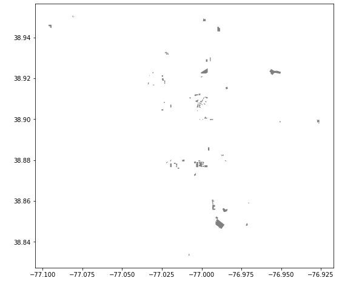

# Creating Zoning Maps Using Python & Pandas
Author: Claire Morehouse

Date: Nov 12 2020

This lab using Python package Pandas to import PUDs - Planned Unit Development - shapefile for DC and an affordable housing dataset and
turns the afforable housing csv into a geodataframe and merges the shapefile and the csv file based on the geographic intersection. A master geodataframe
is created containing the information about zoning exemptions as well as affordable housing projects at the same geographic locations. The final step 
merges this with the a zoning categories crosswalk to get the zoning cateogories in "plain english." The final output is a map of the PUDs that offer 
affordable housing. A map was also created in carto to show this data (linked below). 

The final output: Map of PUDS the offer affordable housing

Link to Carto: https://comorehouse1620.carto.com/builder/79bea754-1aed-4de8-b6df-05cbffee979a/embed

